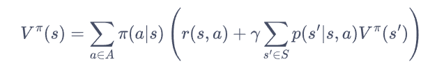
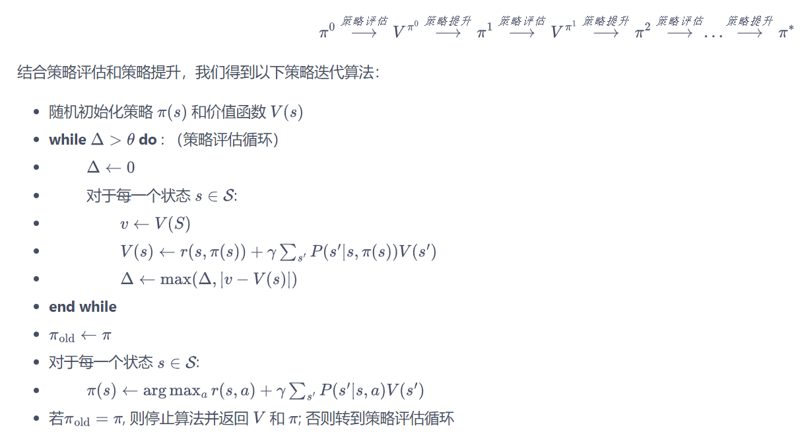
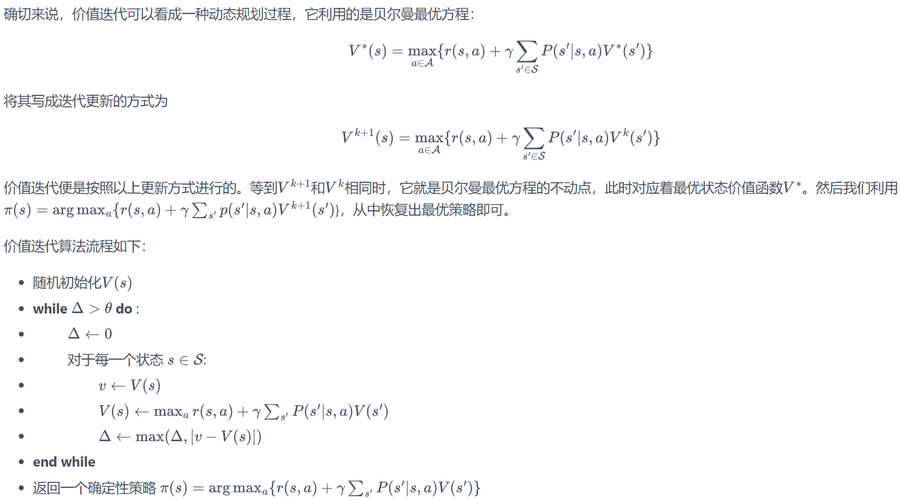

# 动态规划

* [动态规划](https://hrl.boyuai.com/chapter/1/%E5%8A%A8%E6%80%81%E8%A7%84%E5%88%92%E7%AE%97%E6%B3%95/)
* 策略迭代和价值迭代都是基于贝尔曼期望的展开

* 策略迭代
  * V(s)状态价值的更新就是基于贝尔曼期望
  * 在某种策略下，要对**每个可能动作**的**每个动作的所有可能的转移结果**进行计算并累加(参考frozen_lake例子) gamma * sum_{s'}P(s'|s,pi(s))V(s')

* 价值迭代
  * 与策略迭代不同的是，更新V(s)取得是max action, 贪心的思路

* 收敛性证明详见原链接。。。
