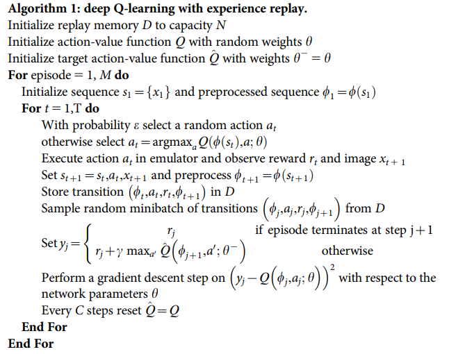
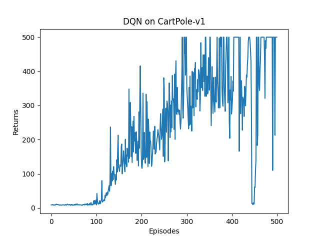
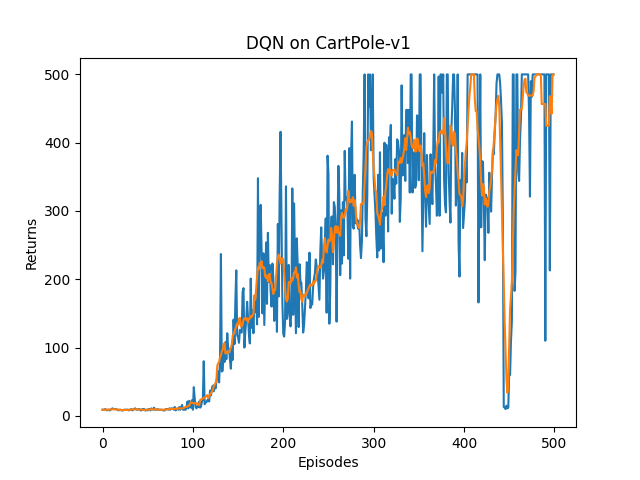

# DQN

* [DQN 算法](https://hrl.boyuai.com/chapter/2/dqn%E7%AE%97%E6%B3%95)
* [Playing Atari with Deep Reinforcement Learning](https://www.cs.toronto.edu/~vmnih/docs/dqn.pdf) 2013
* [Human-level control through deep reinforcement learning](https://storage.googleapis.com/deepmind-media/dqn/DQNNaturePaper.pdf) 2015
* DQN 是 RL 与深度神经网络(那个时候的深度网络现在看太浅了……)结合的代表作, 同时也是开创了深度强化学习的问题建模(状态、action、reward)与求解范式



## 原理
* 动作价值更新是基于Q-Learning的 TD-error
  * $Q(s_t, a_t) \leftarrow Q(s_t, a_t) + \alpha[r_t + \gamma \max_{a} Q(s_{t+1}, a) - Q(s_t, a_t)]$
* 显然优化目标是要最小化 $r_t + \gamma \max_{a} Q(s_{t+1}, a)$ 和 $Q(s_t, a_t)$ 的差值
* 这个差值可以用 MSE Loss 来表示
* $\omega^{*} = \arg\max_{\omega}\frac{1}{2N}\sum^{N}_{i=1}[Q_{\omega}(s_i, a_i) - (r_i + \gamma \max_{a'} Q_{\omega}(s'_{i}, a'))]^2$
* 使用神经网络来计算Q(s,a), 上述MSE Loss即为网络的损失函数

## 实现细节
* e-greedy方法执行动作，epsilon的概率随机选动作以平衡探索与挖掘
* 经验回放(experience replay), 每次从环境中采样得到的四元组数据(s,a,r,s')存储到缓冲区，训练Q网络时采样一定数量
* 两套网络：Q-net & target-Q-net
  * TD 误差目标本身包含神经网络的输出，因此在更新网络参数的同时目标也在不断地改变，这非常容易造成神经网络训练的不稳定性
  * Q-net 用于计算 $Q_{\omega}(s_t, a_t)$, 正常走梯度下降更新
  * target-Q-net 用于计算 $r_t + \gamma \max_{a} Q_{\omega^-}(s_{t+1}, a)$
  * 每C步，target-Q-net的参数更新为Q-net的参数, target-Q-net 不是实时更新的
```python
# states 是包含所有的缓存采样状态 + 此次行动状态的 状态向量(矩阵)
q_values = self.q_net(states).gather(1, actions)  # Q 值
# 下个状态的最大Q值
max_next_q_values = self.target_q_net(next_states).max(1)[0].view(
    -1, 1)
q_targets = rewards + \
            self.gamma * max_next_q_values * (1 - dones)  # TD误差目标
dqn_loss = torch.mean(F.mse_loss(q_values, q_targets))  # 均方误差损失函数
self.optimizer.zero_grad()  # PyTorch中默认梯度会累积,这里需要显式将梯度置为0
dqn_loss.backward()  # 反向传播更新参数 即更新Q-network的参数
self.optimizer.step()

# 更新目标网络
if self.count % self.target_update == 0:
    self.target_q_net.load_state_dict(
        self.q_net.state_dict())
self.count += 1
```

* 训练情况



