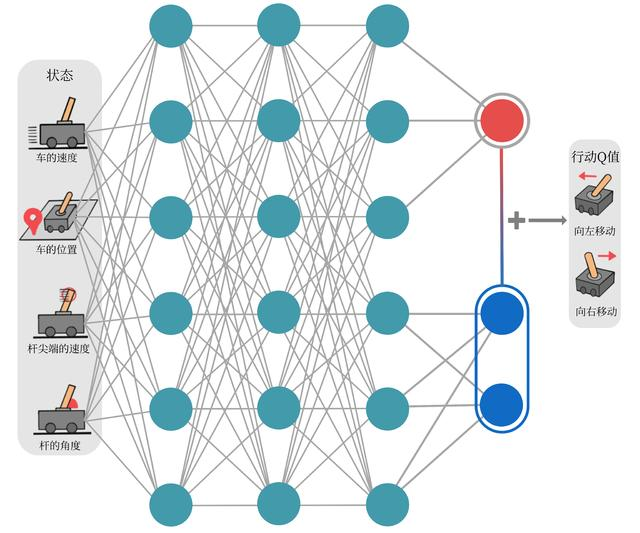

# DQN 改进

* [DQN 改进算法](https://hrl.boyuai.com/chapter/2/dqn%E6%94%B9%E8%BF%9B%E7%AE%97%E6%B3%95)
* [Deep reinforcement learning with double q-learning](https://arxiv.org/pdf/1509.06461) 2015 David Silver 在其中做了DQN过高估计的证明
* [Dueling network architectures for deep reinforcement learning](https://arxiv.org/pdf/1511.06581) 2016

## Double DQN
* 为了避免估计动作价值时的过高估计, 引入了 Double DQN
* 训练时使用 target-Q-net 来计算 $r_t + \gamma Q_{\omega^-}(s_{t+1}, \arg\max_{a'} Q_{\omega}(s_{t+1}, a'))$
* 用 Q-net计算下一状态的动作, 再用 target-Q-net 计算该动作的Q值

```python
# 下个状态的最大Q值
if self.dqn_type == 'DoubleDQN': # DQN与Double DQN的区别
    max_action = self.q_net(next_states).max(1)[1].view(-1, 1)
    max_next_q_values = self.target_q_net(next_states).gather(1, max_action)
else: # DQN的情况
    max_next_q_values = self.target_q_net(next_states).max(1)[0].view(-1, 1)
```

* 对比DQN的Q-Value和DoubleDQN的Q-Value, 可以看到DoubleDQN较少出现Q值大于0的情况, 改善了Q的过高估计问题


## Dueling DQN
* 引入了优势函数 $A(s,a) = Q(s,a) -V(s)$
* 在同一个状态下，所有动作的优势值之和为 0，因为所有动作的动作价值的期望就是这个状态的状态价值
* Dueling DQN 采用神经网络来建立state和action到Q\V\A的映射 $Q_{\phi,\alpha,\beta}(s,a) = V_{\phi,\alpha}(s) + A_{\phi,\beta}(s,a)$



* 将状态价值V和优势函数A分别建模，有助于agent在不同状态下决策出将关注重点放在state或者是action
* 拿自动驾驶举例, 当智能体前面没有车时更关注状态价值, 当前面有车时关注动作价值的优势
* 实际实现时为了保证训练的稳定，可以做如下优化优化

$Q_{\phi,\alpha,\beta}(s,a)  = V_{\phi,\alpha}(s) + A_{\phi,\beta}(s,a)-\max_{a'}A_{\phi,\beta}(s,a')$

* 或者

$Q_{\phi,\alpha,\beta}(s,a)  = V_{\phi,\alpha}(s) + A_{\phi,\beta}(s,a)-\frac{1}{|action|}\sum_{a'}A_{\phi,\beta}(s,a')$

```python
class VAnet(torch.nn.Module):
    ''' 只有一层隐藏层的A网络和V网络 '''
    def __init__(self, state_dim, hidden_dim, action_dim):
        super(VAnet, self).__init__()
        self.fc1 = torch.nn.Linear(state_dim, hidden_dim)  # 共享网络部分
        self.fc_A = torch.nn.Linear(hidden_dim, action_dim)
        self.fc_V = torch.nn.Linear(hidden_dim, 1)

    def forward(self, x):
        A = self.fc_A(F.relu(self.fc1(x)))
        V = self.fc_V(F.relu(self.fc1(x)))
        Q = V + A - A.mean(1).view(-1, 1)  # Q值由V值和A值计算得到
        return Q
```

* 对比Dueling与DQN的return, Dueling会更快的趋向稳定, 得到的平均回报更大


