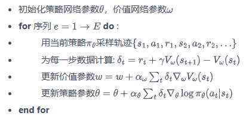
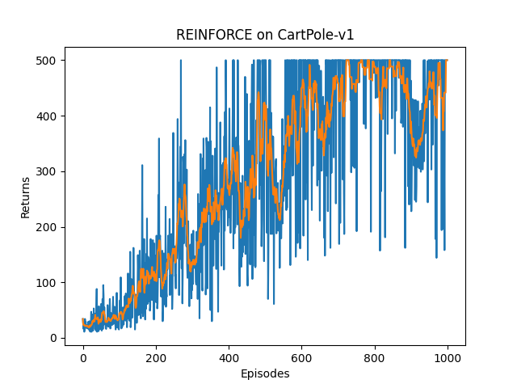
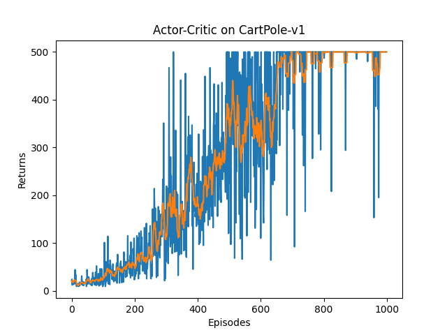
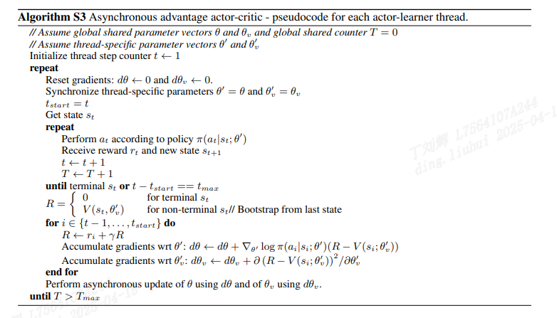
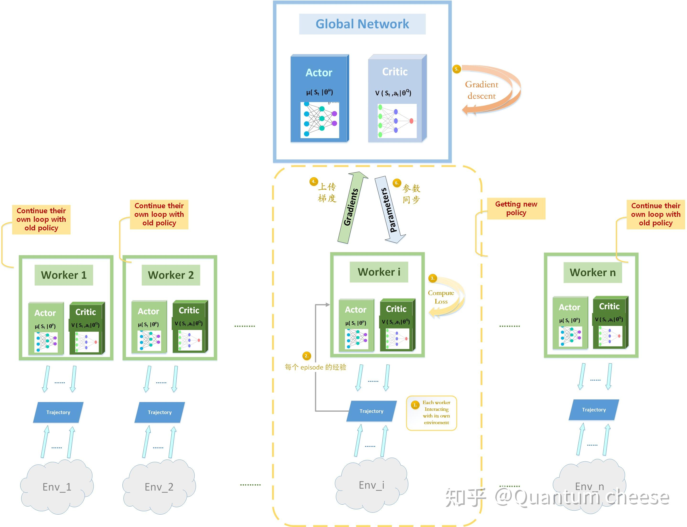
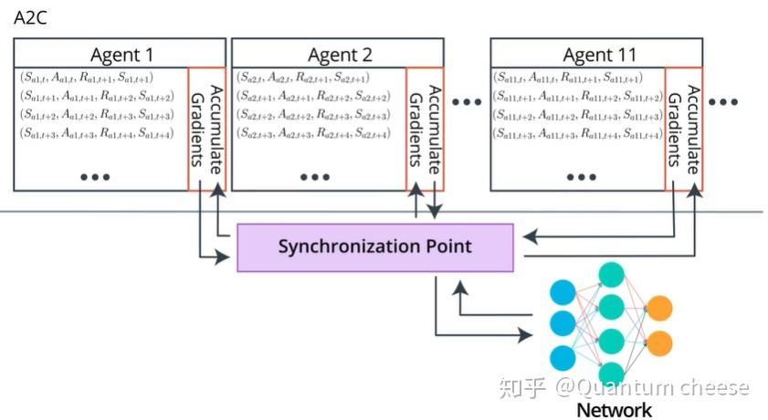

# Actor-Critic 演员评论家

* [Actor-Critic 演员评论家](https://hrl.boyuai.com/chapter/2/actor-critic%E7%AE%97%E6%B3%95/)

## actor-critic 原理
* actor-critic 同时引入价值模型和策略模型, actor对应策略模型 policy-based, critic对应价值模型 value-based
* 也是基于 actor-critic 这种强化学习范式, 延伸出了很多前沿的强化学习范式, 比如 TRPO PPO 甚至是 GPRO 等
* 对于策略梯度, $\nabla_{\theta} J(\theta)=E_{\pi_{\theta}}[\sum_{t=0}^{T}(\sum_{t'=t}^{T}\gamma^{t'-t}r_{t'})\nabla_{\theta}\log{\pi_{\theta}(a_t|s_t)}]$
* 可以写成更加一般化的形式 $g =E[\sum_{t=0}^{T}\phi_{t}\nabla_{\theta}\log{\pi_{\theta}(a_t|s_t)}]$, $\phi_{t}$ 作为价值评估项, 可以有多种形式
  1. $\sum_{t'=0}^{T}\gamma^{t'}r_{t'}$  轨迹的总回报
  2. $\sum_{t'=t}^{T}\gamma^{t'-t}r_{t'}$ 动作$a_t$之后的总回报, REINFORCE算法采用的就是这种
  3. $\sum_{t'=t}^{T}\gamma^{t'-t}r_{t'} - b(s_t)$  2的版本改进, 引入基线函数b(s_t)以减小方差, 应对MC采样方法对策略梯度估计存在较大方差的问题, 这是最初的 actor-critic
  4. $Q^{\pi_{\theta}}(s_t, a_t)$  动作价值函数
  5. $A^{\pi_{\theta}}(s_t, a_t) = Q^{\pi_{\theta}}(s_t, a_t) - V^{\pi_{\theta}}(s_{t})$  优势函数, 在3上的改进, Advantage Actor Critic, A2C
  6. $r_t + \gamma V^{\pi_{\theta}}(s_{t+1}) - V^{\pi_{\theta}}(s_{t})$  时序差分误差, A2C在实际实现中, 可以无需Critic网络同时输出Q和V, 采用时序差分误差近似拟合优势函数

* 采用形式4\5\6, 价值评估项就可以使用模型来进行拟合, 模型可以是神经网络, 然后通过梯度下降等凸优化方法对模型进行优化
* 同时相比于采样式的价值更新方式, 值函数拟合的值估计可以在agent的每一步都进行更新, 不需要等一组行动序列(MC采样), 也不需要限制行动的步数
* 采用值函数/模型去拟合价值估计模型, 同时保留策略模型, 这就是actor-critic范式
* actor对应策略模型 policy-based, 与环境交互, 在critic指导下采用策略梯度更新
* critic对应价值模型 value-base, 对每一步进行评价, 根据价值函数的loss形式进行更新
  * 如果采用上述形式6的时序差分误差, loss和DQN中的目标网络更新形式类似, 构建损失函数 $\nabla_{\omega}L(\omega)=-(r + \gamma V_{\omega}(s_{t+1}) - V_{\omega}(s_t))\nabla_{\omega}V_{\omega}(s_t)$

## 更新方法


```python
class PolicyNet(torch.nn.Module):
    def __init__(self, state_dim, hidden_dim, output_dim):
        super(PolicyNet, self).__init__()
        self.fc1 = torch.nn.Linear(state_dim, hidden_dim)
        self.fc2 = torch.nn.Linear(hidden_dim, output_dim)

    def forward(self, x):
        x =F.relu(self.fc1(x))
        return F.softmax(self.fc2(x), dim=1)

class ValueNet(torch.nn.Module):
    def __init__(self, state_dim, hidden_dim):
        super(ValueNet, self).__init__()
        self.fc1 = torch.nn.Linear(state_dim, hidden_dim)
        self.fc2 = torch.nn.Linear(hidden_dim, 1)

    def forward(self, x):
        x = F.relu(self.fc1(x))
        return self.fc2(x)

class ActorCritic:
    def update(self, transition_dict):
        def update(self, transition_dict):
        # 更新时, 传入一条采样轨迹
        states = torch.tensor(transition_dict['states'], dtype=torch.float).to(self.device)
        actions = torch.tensor(transition_dict['actions']).view(-1, 1).to(self.device)
        rewards = torch.tensor(transition_dict['rewards'], dtype=torch.float).view(-1, 1).to(self.device)
        next_stats = torch.tensor(transition_dict['next_states'], dtype=torch.float).to(self.device)
        dones = torch.tensor(transition_dict['dones'], dtype=torch.float).view(-1, 1).to(self.device)

        # 不同于上一节 REINFORCE 算法采用策略回报, 需要迭代的计算整个序列的策略回报
        # 此处采用的是 时序差分误差, 可以独立的计算序列里每一步的时序差分误差
        td_target = rewards + self.gamma * self.critic(next_stats) * (1 - dones)
        td_loss = td_target - self.critic(states)  # critc 时序差分误差
        log_probs = torch.log(self.actor(states).gather(1, actions))
        actor_loss = torch.mean(-log_probs * td_loss.detach())
        # critic 和 dqn一样采用mse loss
        critic_loss = torch.mean(F.mse_loss(self.critic(states), td_target.detach()))
        self.actor_optimizer.zero_grad()
        self.critic_optimizer.zero_grad()
        actor_loss.backward()
        critic_loss.backward()
        self.actor_optimizer.step()
        self.critic_optimizer.step()
```

## 结果对比
* 上一节REINFORCE算法

* actor-critic

* 相比之下actor-critic训练过程中的returns会更加稳定, 抖动(方差)幅度明显改善, 说明方差减小有效

# A2C vs A3C
- 提出A3C算法的paper [Asynchronous Methods for Deep Reinforcement Learning](https://arxiv.org/pdf/1602.01783) 2016


- A3C是一种将A2C算法探索过程异步化的方法, 以提升算法的训练效率
- 参考 https://zhuanlan.zhihu.com/p/148492887 解析A3C的方法: global net保存全局的网络参数, 每个 worker在完成探索后, 向global上传梯度, global更新, 然后更新worker的网络, 此时其他worker继续行动或者等待轮到自己与global交互


- 其实A2C也可以采用异步的方法, 不过不同于A3C更新global网络的方式, A2C更新需要等待所有work都完成探索, 然后收集所有梯度, 再同步参数给所有worker, 对于算力有限的个人用户而言(GPU显存不足), 可能A3C独立的更新会更有效率; 但是对于显存充足的GPU集群, A2C的同步更新可能反而能发挥大批量并行计算的优势, 效率更高
- actor_critic.py 实现的就是A2C, 不过是单worker的


- A3C 中各个 agent 都是异步独立更新, 每个 agent 使用不同的策略, 可能会导致 global policy 的累计更新效果并不是最优（optimal）的, 异步更新反而是A3C的劣势了; 而 A2C 通过同步更新解决了这种不一致(inconsistency)的问题, 从而潜在的加快收敛
- 总的来说, 在2016年的时间节点, A2C和A3C都是state-of-art的范式了, 下一个时代准备开启.
